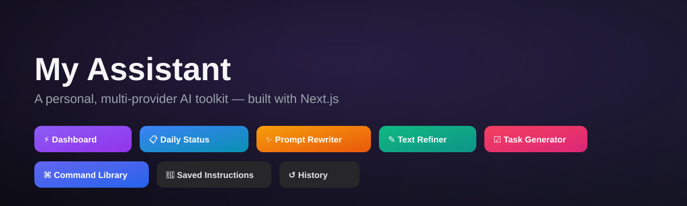
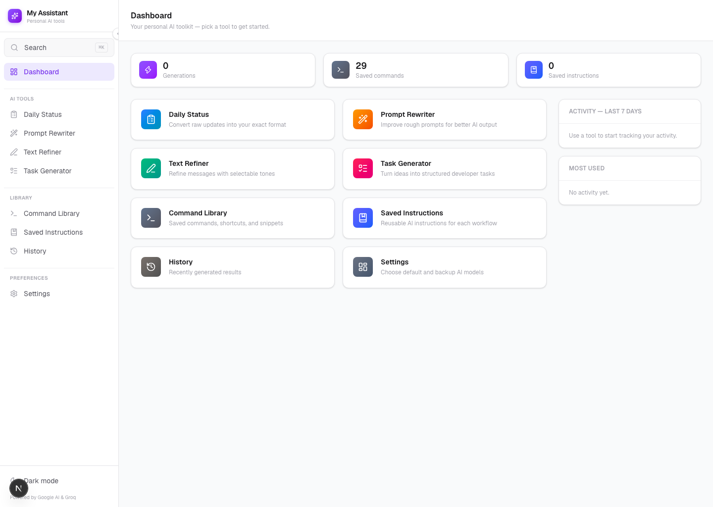

<div align="center">



# My Assistant

**A personal, multi-provider AI toolkit for everyday writing and dev workflows.**

[](https://nextjs.org)
[](https://react.dev)
[](https://www.typescriptlang.org)
[](https://tailwindcss.com)
[](https://ai.google.dev)
[](https://groq.com)

</div>

---

## What is this?

**My Assistant** is a single-user productivity dashboard that wraps several everyday AI tasks — turning raw notes into a daily status update, rewriting rough prompts, refining tone, and generating structured dev tasks — behind one clean, keyboard-friendly UI. It's designed to feel like a focused internal tool, not a generic chatbot: pick a card, paste your text, get a formatted result, copy it, move on.

It talks to **two AI providers** (Google Gemini and Groq) with an automatic primary/backup fallback, so a rate limit or outage on one provider doesn't stop your work.

## ✨ Features

| Tool | What it does |
|---|---|
| 📊 **Dashboard** | At-a-glance usage stats and quick links into every tool |
| 📋 **Daily Status** | Converts raw standup notes into your exact reporting format |
| ✨ **Prompt Rewriter** | Turns a rough prompt into a clearer, more effective one |
| ✎ **Text Refiner** | Rewrites messages in a selectable tone (formal, casual, concise…) |
| ☑ **Task Generator** | Turns a loose idea into structured, actionable dev tasks |
| ⌘ **Command Library** | Saved shell commands, shortcuts, and snippets, searchable in one place |
| 🔖 **Saved Instructions** | Reusable system prompts/instructions per workflow |
| ↺ **History** | Every generation you've made, with the ability to revisit or copy it again |
| ⚙️ **Settings** | Choose your primary and backup AI provider/model |

Other niceties: a `⌘K` command palette for jumping between tools, one-click copy on every result, a mobile nav drawer, and per-tool usage charts on the dashboard.

<p align="center">
  
</p>

## 🧠 AI Providers

| Provider | Models available |
|---|---|
| **Google Gemini** | 2.5 Pro, 2.5 Flash, 2.5 Flash Lite, 2.0 Flash |
| **Groq** | Llama 3.3 70B Versatile, Llama 3.1 8B Instant, GPT-OSS 120B, Kimi K2 Instruct |

Set a primary provider/model and an optional backup in **Settings** — if the primary call fails, the app automatically retries on the backup.

## 🛠️ Tech Stack

- **Framework:** [Next.js 16](https://nextjs.org) (App Router) + [React 19](https://react.dev)
- **Language:** TypeScript
- **Styling:** Tailwind CSS v4, [Framer Motion](https://www.framer.com/motion/) for animation
- **UI primitives:** Radix UI (dialog, switch), [cmdk](https://cmdk.paco.me/) for the command palette, [lucide-react](https://lucide.dev/) icons
- **AI SDKs:** `@google/genai`, `groq-sdk`

## 🚀 Getting Started

**1. Clone and install**

```bash
git clone <your-repo-url>
cd assistant
npm install
```

**2. Add your API keys**

Create a `.env.local` file in the project root:

```bash
GEMINI_API_KEY=your_gemini_api_key
GROQ_API_KEY=your_groq_api_key
```

- Get a free Gemini key from [Google AI Studio](https://aistudio.google.com/apikey)
- Get a free Groq key from [console.groq.com](https://console.groq.com/keys)

**3. Run it**

```bash
npm run dev
```

Open [http://localhost:3000](http://localhost:3000) — that's it.

## ☁️ Deploy for free (access it from anywhere)

This app deploys to [Vercel](https://vercel.com) in a couple of clicks — free tier, automatic HTTPS, and a public URL you can open from your phone or any device:

1. Push this repo to GitHub.
2. Import it at [vercel.com/new](https://vercel.com/new).
3. Add `GEMINI_API_KEY` and `GROQ_API_KEY` as environment variables in the project settings.
4. Deploy — Vercel builds and hosts it automatically on every push.

## 📁 Project Structure

```
src/
├── app/                  # Routes (one folder per tool) + API route for generation
├── components/
│   ├── layout/           # Sidebar, mobile nav, command palette, page shell
│   ├── tools/             # Cards, panels, charts used across tool pages
│   └── ui/                # Buttons, badges, textarea, skeletons — shared primitives
├── lib/
│   ├── ai/                # Provider clients (Gemini, Groq), model config, generation logic
│   └── hooks/              # Local-storage-backed hooks for history, library, settings
└── types/                 # Shared TypeScript types
```

## 🔒 Privacy

Everything you save (commands, instructions, history) stays in your browser's local storage — nothing is sent anywhere except the AI provider you choose, and only the text you submit for generation. Your API keys live in environment variables and are never exposed to the browser.

---

<div align="center">
<sub>Built as a personal productivity tool — not a ChatGPT clone.</sub>
</div>
